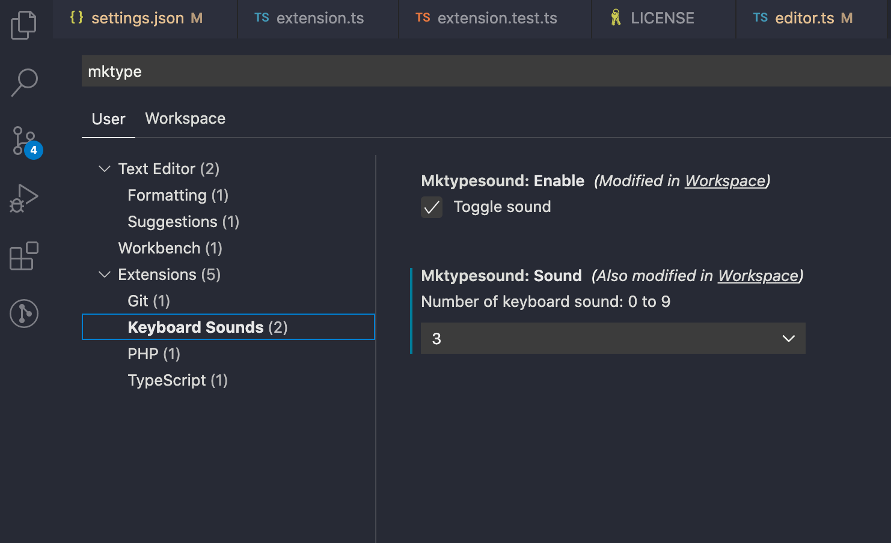

# Mechanical Keyboard Type sounds for VSCPDE
Let your VSCode sound like a Mechanical Keyboard.
Up to 10 different key sounds and volume control.

- On Windows/Linux - File > Preferences > Settings
- On macOS - Code > Preferences > Settings


# Extension
https://marketplace.visualstudio.com/items?itemName=pello.mktypesound-vscode
# Repo
 https://github.com/pxai/mktypesound-vscode

# Local test
code \
 --extensionDevelopmentPath=<EXTENSION-ROOT-PATH> \
 --extensionTestsPath=<TEST-RUNNER-SCRIPT-PATH>

 ```bash
 code --extensionDevelopmentPath=. --extensionTestsPath=.
 ```

# Instalation
* ctrl+shift+p on Visual Studio Code
* 'Extensions: Install Extension'
* 'Mechanical Keyboard Sound'
* Restart VS Code

# Removal
* ctrl+shift+p
* 'Extensions: Show Installed Extensions'
* Select the remove box 


# Dev:

- vsce login
- vsce package
- vsce publish

Inspired on Timmy Reilly's https://github.com/timmyreilly/TypewriterNoises-VSCode